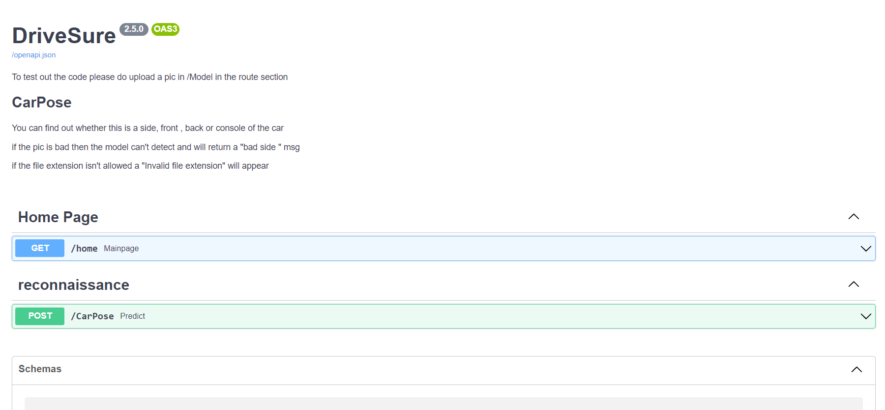
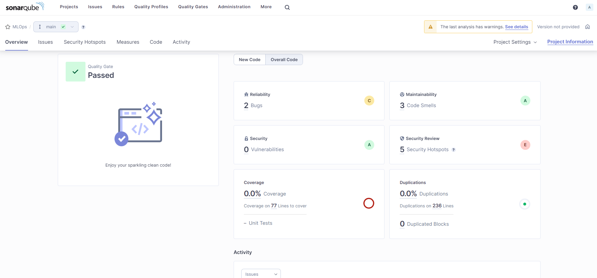

# OCR Project
## Car Side Recognition and Data Extraction App

## Table of Contents

1. [Overview](#overview)
2. [FastAPI and Swagger UI](#fastapi-and-swagger-ui)
3. [Python Modules](#python-modules)
4. [Requirements Generation](#requirements-generation)
5. [Docker and Debian](#docker-and-debian)
6. [Docker Compose](#docker-compose)
7. [Kubernetes](#kubernetes)
8. [SonarQube Integration](#sonarqube)
9. [GitLab](#gitlab)
10. [Usage Snippets](#usage-snippets)

## Overview

This is an application that uses machine learning to recognize and classify car poses from images, extract license plate information, and perform identity card recognition. The application is built with FastAPI and Dockerized for convenient deployment.

## FastAPI and Swagger UI

FastAPI is a modern, high-performance web framework for building APIs with Python 3.7+ based on standard Python type hints. One of the standout features of FastAPI is the automatic interactive API documentation via Swagger UI.

## Python Modules

Several Python modules are used in this project. Notably, `fastapi` is used for the web framework, `tensorflow` for working with the pre-trained machine learning model, `python-multipart` for handling file uploads, and `pydantic` for data validation and settings management.

## Requirements Generation

Generating the `requirements.txt` file for a Python project can sometimes be tricky, especially when dealing with complex dependencies. We've used `pipreqs` and `pireqs` for this purpose.

## Docker and Debian

The application is containerized using Docker, based on a Debian image. Debian was chosen for its balance of stability, long-term support, and a rich repository of packages.

## Docker Compose

We are utilizing Docker Compose to handle multi-container Docker applications. With a single command, we are able to create and start all the services from our configuration.

## Kubernetes

We're using Kubernetes for orchestration of our Docker containers. Kubernetes helps us ensure that our application runs reliably and efficiently on any infrastructure.

## SonarQube Integration

SonarQube has been integrated with the application in two ways:

1. Docker Compose: A SonarQube container has been included in the Docker Compose setup, along with a PostgreSQL container for storing SonarQube data.
2. Kubernetes: SonarQube and PostgreSQL pods have been deployed on Kubernetes to enable code analysis and quality checks.

## GitLab

We're using GitLab as our version control system. It provides a centralized platform to work collaboratively on our projects and includes source code management, CI/CD pipelines, and more.

### GitLab Pipeline

The GitLab pipeline has been set up with the following stages:

1. Build: The application is built and packaged.
2. Test: Unit tests and integration tests are executed to ensure the code's correctness.
3. Code Quality: SonarQube is used to perform code analysis and review for maintaining code quality.
4. Containerize: The frontend and backend components are Dockerized.
5. Push to Docker Hub: The Docker images are pushed to a private repository on Docker Hub.
6. Deploy: Kubernetes is configured to deploy the Dockerized components.

## Usage Snippets

### Building Docker image and running it:
$ docker build -t image .
$ docker run -p port:port image

### Running FastAPI app:
python -m uvicorn file:app --reload

### Executing command in Docker container:
docker exec -it Container_Id sh
exit

### Using Docker compose:
docker-compose build
docker-compose up

### Pushing image to Docker Hub:
docker tag image:latest user/repo:tag
docker push user/repo:tag

### Converting Docker compose to Kubernetes:
docker run --rm -it -v $PWD:/opt kompose sh -c "cd /opt && kompose convert"

### Cleaning up exited Docker containers:
docker rm $(docker ps -a -q -f status=exited)
# or
docker container prune

### Kubernetes
kubectl get service web
kubectl delete deployments --all
kubectl apply -f file

### ingress
helm uninstall my-nginx
helm install my-nginx ingress-nginx/ingress-nginx

kubectl apply -f app-ingress.yaml

### Port forwarding 
kubectl port-forward service/service port:port
